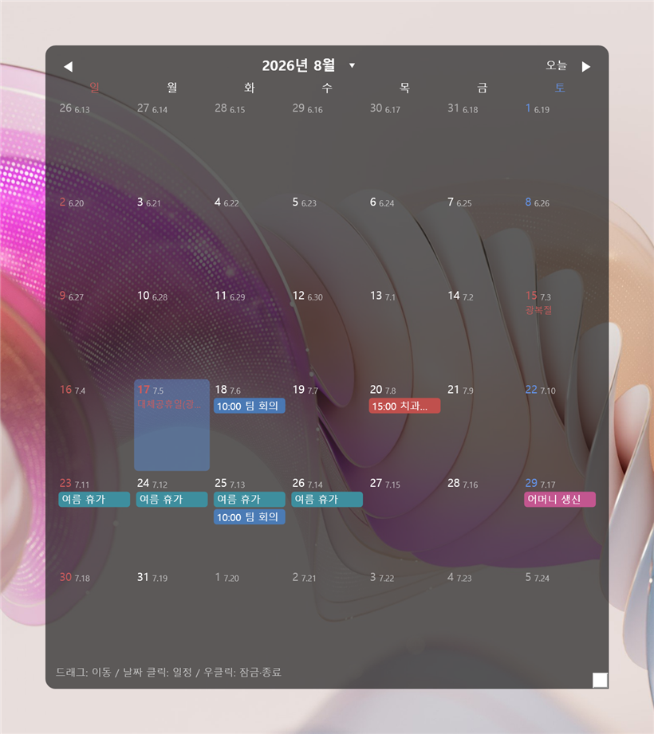

# 바탕화면 배경 달력

윈도우 바탕화면에 붙박이로 떠 있는 달력 위젯입니다. 배경화면 위, 데스크톱 아이콘 뒤에 자리잡아서
창을 띄우지 않아도 이번 달 일정이 늘 보입니다.



## 기능

- **일정** — 등록·수정·삭제, 여러 날에 걸친 일정, 색상 구분, 시작 전 알림
- **반복** — 매일 / 매주 / 매월 / 매년, 그리고 **음력 매년**(음력 생일·제사). 특정 회차만 건너뛸 수 있습니다
- **음력** — 음력으로 날짜를 골라 등록하고, 달력 각 날짜 옆에 음력을 함께 표시합니다
- **공휴일** — 대체공휴일까지 앱이 직접 계산해 API 키 없이도 표시됩니다.
  공공데이터포털 키를 넣으면 임시공휴일(선거일 등)까지 정확히 받아옵니다
- **D-day** — 위젯 위쪽에 남은 일수 표시, 매년 반복 지원
- **구글 캘린더** — 읽기 전용으로 가져와 로컬 일정과 함께 보여줍니다 (표시 여부 토글 가능)
- **꾸미기** — 배경 색상·투명도, 글자 크기, 주 시작 요일(일/월)
- **백업** — 일정·D-day를 파일로 저장/복원, iCalendar(.ics) 내보내기

## 설치

### 이미 만들어진 실행파일이 있다면

`DesktopCalendar.exe` **파일 하나만** 원하는 곳(USB, 다른 PC 등)에 복사하고 더블클릭하면 됩니다.
.NET을 따로 설치할 필요가 없습니다. 서명이 없어 처음 실행할 때 SmartScreen이
"Windows에서 PC를 보호했습니다" 경고를 띄울 수 있는데, [추가 정보] → [실행]으로 넘어가면 됩니다.

> 일정 데이터는 실행파일이 아니라 **각 PC의** `%AppData%\DesktopCalendar\calendar.db`에 저장됩니다.
> 다른 PC로 옮길 때 기존 일정도 가져가려면 앱의 **[백업 / 내보내기]** 로 `.json`을 저장해 옮긴 뒤 복원하세요.

### 직접 빌드하기 — 스크립트 (권장)

[.NET 8 SDK](https://dotnet.microsoft.com/download/dotnet/8.0)를 설치한 뒤, 받아온 폴더 안의 `.cmd` 파일을 **더블클릭**하면 됩니다.

| 파일 | 하는 일 |
|---|---|
| `run.cmd` | 소스에서 바로 실행해 봅니다 (창을 닫으면 앱도 종료) |
| `build.cmd` | 빌드 + 테스트를 돌려 이상이 없는지 확인합니다 |
| `publish.cmd` | **배포용 실행파일 하나**(`dist\DesktopCalendar.exe`, 약 70MB)를 만듭니다 |

SDK 없이 런타임만 설치돼 있으면 빌드가 되지 않습니다. 스크립트가 그 상황을 알려주고 설치 명령(`winget install Microsoft.DotNet.SDK.8`)을 안내합니다.

실행파일을 특정 위치에 두고 **Windows 시작 시 자동 실행**까지 쓰려면, 파일을 원하는 자리에 옮긴 뒤 앱의 설정 창에서 [Windows 시작 시 자동 실행]을 껐다 켜세요. 지금 실행 중인 exe 경로로 바로가기가 다시 만들어집니다.

### 직접 빌드하기 — 명령어

```bash
git clone https://github.com/lucki3377/my_desktop_calendar.git
cd my_desktop_calendar

dotnet run --project src/DesktopCalendar.App    # 바로 실행
dotnet test DesktopCalendar.sln                 # 테스트

# 단일 파일 배포본 (dist\DesktopCalendar.App.exe → DesktopCalendar.exe 로 이름만 바꿔 쓰면 됩니다)
dotnet publish src/DesktopCalendar.App -c Release -r win-x64 --self-contained -p:PublishSingleFile=true -p:IncludeNativeLibrariesForSelfExtract=true -p:EnableCompressionInSingleFile=true -p:DebugType=none -o dist
```

## 사용법

위젯을 **우클릭**하면 설정·D-day 관리·도움말이 나옵니다. 트레이 아이콘에서도 같은 메뉴를 열 수 있습니다.

- 드래그로 옮기고, 오른쪽 아래 모서리로 크기를 조절합니다. 자리를 잡았으면 [위치 잠금]
- 날짜를 클릭하면 그 날의 일정 목록이 열립니다
- 구글 캘린더 연동과 공휴일 API 키 발급 절차는 앱 안의 **[도움말]** 에 단계별로 정리해 두었습니다

## 설정과 데이터

일정·설정은 `%AppData%\DesktopCalendar\calendar.db` 한 곳에 저장됩니다.
구글 로그인 정보와 클라이언트 보안 비밀은 Windows DPAPI로 암호화해서 넣습니다.

이 파일 하나에만 있으니, PC를 초기화하면 함께 사라집니다.
설정 → 데이터 → [백업 파일로 저장]으로 가끔 다른 곳에 복사해 두세요.

## 만드는 데 쓴 것

C# / WPF (.NET 8). 배경화면과 아이콘 사이에 창을 넣는 것은 `WorkerW` 방식을 씁니다
(Rainmeter 등이 쓰는 것과 같은 원리).

| 용도 | 패키지 |
|---|---|
| 저장 | Microsoft.Data.Sqlite |
| 구글 캘린더 | Google.Apis.Calendar.v3, Google.Apis.Auth |
| 트레이 아이콘 | Hardcodet.NotifyIcon.Wpf |
| 토큰 암호화 | System.Security.Cryptography.ProtectedData |

설계와 진행 기록은 [DESIGN.md](DESIGN.md)에 있습니다.

## 라이선스

[MIT](LICENSE)
